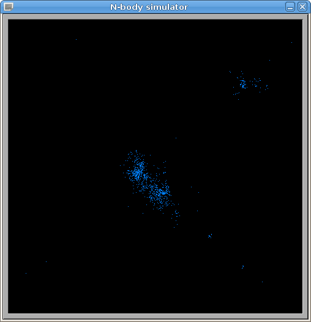

**Due: Friday, April 10th by 11:59 PM**

Getting Started
===============

Download [CS365\_Assign03.zip](CS365_Assign03.zip). Unzip it on the cluster head node (or your local machine, if you are running Linux).

There are two source files **nbody\_seq.c** and **nbody\_par.c**. These source files are initially the same (except for a comment at the beginning of the file.) You can compile both programs using the command:

    make

To run the programs:

    ./nbody_seq

    ./nbody_par

If you are going to compile this on your own computer running Linux, you will need to have the [XForms](http://xforms-toolkit.org/) development libraries installed. On Ubuntu, Debian, and Mint, run the command

    sudo apt-get install libforms-dev

N-Body Simulation
=================

An [N-Body Simulation](http://en.wikipedia.org/wiki/N-body_simulation) is a simulation of the motion of an arbitrary number of physical bodies influenced by physical forces, such as gravity:

> 

The simulation consists of a collection of *particles*, which are the bodies. At each time step of the simulation, for each particle in the simulation, the forces on that particle are computed. In the case of simulating gravitational attraction, a particle will be attracted to every other particle, with the magnitude and direction of the force depending on the distance between the particles and their relative positions.

Because each particle acts on every other particle, there are O(<i>N</i>2) interactions that must be simulated at each time step.

Your Task
=========

Your task is to modify the **nbody\_par.c** program so that it uses threads to speed up the computation in the **nbody\_tick** function. Use exactly 4 threads. The basic idea is to have each thread update a different range of particles at each time step.

You will need to think carefully about how to parallelize the computation.

Hints
-----

Here is a suggested approach:

-   Add fields to the **NBody** struct type to coordinate the activities of worker threads.
-   Change **nbody\_init** so that it creates worker threads. The worker threads can use the **NBody** struct as their argument. The initial state of the **NBody** struct should indicate that there is no work to do, so that the workers initially are suspended waiting for work.
-   The worker threads should wait until field values in the **NBody** struct indicate that there is work to do. (Hint: wait on a condition variable.)
-   When a call to **nbody\_tick** is made, it should update field values in the **NBody** struct (**sim**) to tell the worker threads that it is time to recompute the forces on each particle. This change should wake up the worker threads. (Hint: broadcast on a condition variable.)
-   When a worker thread detects that it is time to do a computation, it should determine which part of the computation needs to be done; specifically, which range of particles in the particles array need to have their forces recomputed.
-   When a worker finishes its local computation, it should update field values in the **NBody** struct to indicate that progress has been made in completing the computation. (Hint: broadcast on a condition variable.)
-   The **nbody\_tick** function should wait until all particles have been updated before returning. (Hint: wait on a condition variable.)

Grading
=======

-   Worker threads are started and keep running as long as they are needed: 20
-   Work is divided among workers: 20
-   Work is communicated to workers: 20
-   **nbody\_tick** can detect when workers have finished work: 20
-   Particle positions are updated correctly after velocities have been updated: 20

Submitting
==========

Run the command

    make submit

Type your username and password when prompted.
